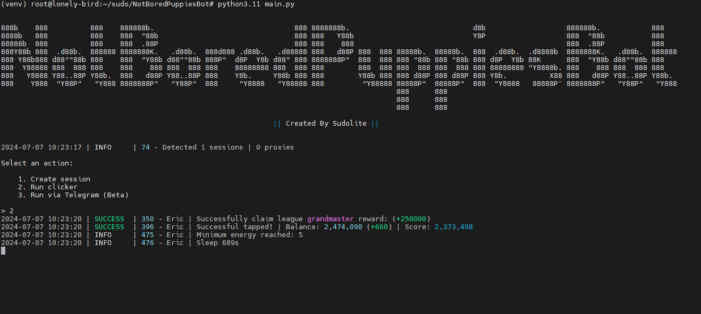

[](https://t.me/SudoLite)



> 🇮🇷 فایل README به فارسی [اینجا](README-FA.md) موجود است

## قابلیت‌ها
| قابلیت                                                         | پشتیبانی شده |
|----------------------------------------------------------------|:------------:|
| چند رشته‌ای (Multithreading)                                   |      ✅       |
| اتصال پروکسی به یک جلسه                                       |      ✅       |
| دریافت خودکار همه وظایف (+ وظایف تلگرام)                       |      ✅       |
| خرید خودکار آیتم‌ها در صورت داشتن سکه (تپ، انرژی، شارژ)       |      ✅       |
| زمان خواب تصادفی بین کلیک‌ها                                   |      ✅       |
| تعداد کلیک‌های تصادفی در هر درخواست                            |      ✅       |
| پشتیبانی از tdata / pyrogram .session / telethon .session      |      ✅       |

## [تنظیمات](https://github.com/SudoLite/NotBoredPuppiesBot/blob/main/.env-example)
| تنظیمات                    | توضیحات                                                                                 |
|----------------------------|------------------------------------------------------------------------------------------|
| **API_ID / API_HASH**      | داده‌های پلتفرمی که از آن یک جلسه تلگرام را راه‌اندازی می‌کنید _(پیش‌فرض - اندروید)_    |
| **MIN_AVAILABLE_ENERGY**   | حداقل مقدار انرژی موجود، که با رسیدن به آن تاخیر ایجاد می‌شود _(مثلاً 100)_            |
| **CLAIM_TASKS**            | آیا باید وظایف را ادعا کنم؟ _(True / False)_                                             |
| **SLEEP_BY_MIN_ENERGY**    | تاخیر در رسیدن به حداقل انرژی به ثانیه _(مثلاً [1500,2100])_                             |
| **ADD_TAPS_ON_TURBO**      | چند تپ اضافه خواهد شد هنگامی که توربو فعال شود _(مثلاً 2500)_                           |
| **AUTO_UPGRADE_TAP**       | آیا باید تپ را بهبود بخشم؟ _(True / False)_                                              |
| **MAX_TAP_LEVEL**          | حداکثر سطح تپ _(تا 20)_                                                                  |
| **AUTO_UPGRADE_ENERGY**    | آیا باید انرژی را بهبود بخشم؟ _(True / False)_                                           |
| **MAX_ENERGY_LEVEL**       | حداکثر سطح انرژی _(تا 20)_                                                               |
| **AUTO_UPGRADE_CHARGE**    | آیا باید شارژ را بهبود بخشم؟ _(True / False)_                                            |
| **MAX_CHARGE_LEVEL**       | حداکثر سطح شارژ _(تا 5)_                                                                  |
| **APPLY_DAILY_ENERGY**     | آیا از افزایش انرژی روزانه رایگان استفاده کنم؟ _(True / False)_                         |
| **APPLY_DAILY_TURBO**      | آیا از افزایش توربو روزانه رایگان استفاده کنم؟ _(True / False)_                         |
| **RANDOM_CLICKS_COUNT**    | تعداد تپ تصادفی _(مثلاً [50,200])_                                                       |
| **SLEEP_BETWEEN_TAP**      | تاخیر تصادفی بین تپ‌ها به ثانیه _(مثلاً [10,25])_                                        |
| **USE_PROXY_FROM_FILE**    | آیا از پروکسی فایل `bot/config/proxies.txt` استفاده کنم؟ _(True / False)_                |

## شروع سریع 📚
1. برای نصب کتابخانه‌ها روی ویندوز روی `INSTALL.bat` کلیک کنید.
2. برای شروع ربات از `START.bat` استفاده کنید (یا در کنسول: `python main.py`).

## پیش‌نیازها
قبل از شروع، مطمئن شوید که موارد زیر نصب شده‌اند:
- [پایتون](https://www.python.org/downloads/) نسخه 3.10 یا 3.11

## دریافت کلیدهای API
1. به [my.telegram.org](https://my.telegram.org) بروید و با استفاده از شماره تلفن خود وارد شوید.
2. **"ابزارهای توسعه API"** را انتخاب کنید و فرم را برای ثبت یک برنامه جدید پر کنید.
3. `API_ID` و `API_HASH` ارائه شده را در فایل `.env` یادداشت کنید.

## نصب
می‌توانید [**مخزن**](https://github.com/SudoLite/NotBoredPuppiesBot) را با کلون کردن آن به سیستم خود دانلود کنید و وابستگی‌های لازم را نصب کنید:
```shell
~ >>> git clone https://github.com/SudoLite/NotBoredPuppiesBot.git
~ >>> cd NotBoredPuppiesBot

# اگر از جلسات Telethon استفاده می‌کنید، سپس شاخه "converter" را کلون کنید
~ >>> git clone https://github.com/SudoLite/NotBoredPuppiesBot.git -b converter
~ >>> cd NotBoredPuppiesBot

# لینوکس
~/NotBoredPuppiesBot >>> python3 -m venv venv
~/NotBoredPuppiesBot >>> source venv/bin/activate
~/NotBoredPuppiesBot >>> pip3 install -r requirements.txt
~/NotBoredPuppiesBot >>> cp .env-example .env
~/NotBoredPuppiesBot >>> nano .env # اینجا باید API_ID و API_HASH خود را مشخص کنید، بقیه به صورت پیش‌فرض است
~/NotBoredPuppiesBot >>> python3 main.py

# ویندوز
~/NotBoredPuppiesBot >>> python -m venv venv
~/NotBoredPuppiesBot >>> venv\Scripts\activate
~/NotBoredPuppiesBot >>> pip install -r requirements.txt
~/NotBoredPuppiesBot >>> copy .env-example .env
~/NotBoredPuppiesBot >>> # API_ID و API_HASH خود را مشخص کنید، بقیه به صورت پیش‌فرض است
~/NotBoredPuppiesBot >>> python main.py
```

همچنین برای شروع سریع می‌توانید از آرگومان‌ها استفاده کنید، برای مثال:
```shell
~/NotBoredPuppiesBot >>> python3 main.py --action (1/2/3)
# یا
~/NotBoredPuppiesBot >>> python3 main.py -a (1/2/3)

#1 - ایجاد جلسه
#2 - اجرای کلیکر
#3 - اجرا از طریق تلگرام
```
